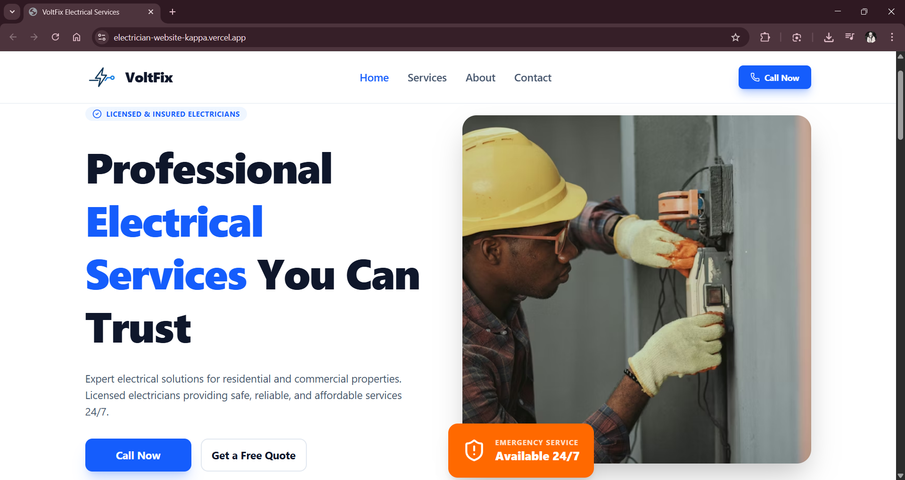

# VoltFix Electrical Services Website ⚡

This is a polished electrician website built with React + Vite + Tailwind. It’s designed to be easy to customize and deploy quickly for small electrical businesses.

👉 Live demo: https://electrician-website-kappa.vercel.app/



---

## ✨ What You Get

✅ **Modern responsive site** — works great on mobile, tablet, and desktop.

✅ **Clear navigation** — organized into:
- Home (hero section + service highlights)
- Services (detailed service cards)
- About (company story and benefits)
- Contact (call-to-action + contact info)

✅ **Easy content updates** — just edit text and image paths in the React files.

✅ **Fast performance** — optimized for quick page loads.

---

## 🔧 How to Customize (No build needed for content updates)

Edit page content in these files:
- `src/pages/Home.tsx`
- `src/pages/About.tsx`
- `src/pages/Services.tsx`
- `src/pages/Contact.tsx`

Content changes show instantly when the site is running.

---

## 🚀 Run Locally

**Prerequisites:** Node.js

```bash
npm install
npm run dev
```

Then open the local URL shown in the terminal (usually `http://localhost:5173`).

---

## 📦 Deploy Live

When you’re ready to publish, deploy the generated `dist/` folder to any static host (Vercel, Netlify, GitHub Pages, Azure, etc.).

---

## 💬 Want New Features?

If you want help adding things like:
- appointment booking / contact form backend
- newsletter signup
- live chat
- reviews or testimonials system

Just ask and I can guide you or implement it for you.
